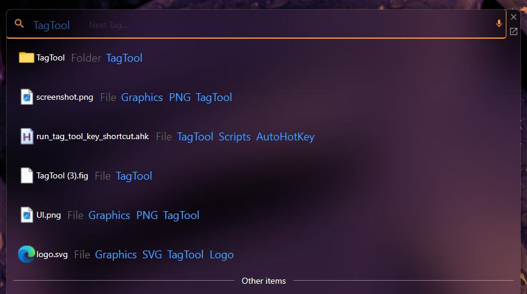
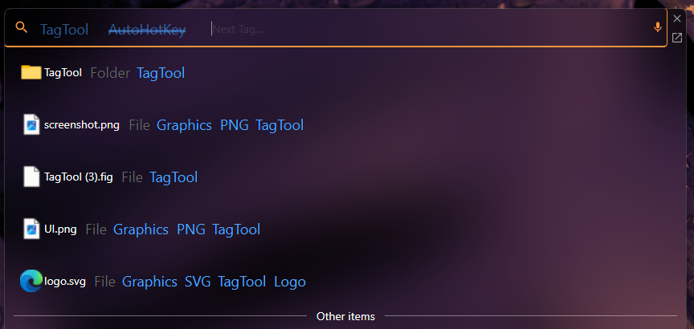
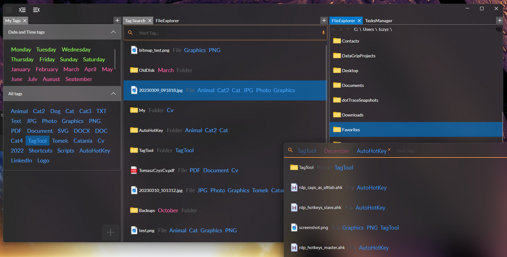

TagTool
=======
No more long searches for files on the computer! Save files by **tagging**, not in some folder... inside another folder...

With **TagTool** you can attach **Tags** to files and folders, and use them later to quickly locate the ones you need.

> This is very much Work In Progress. To run the app you need to build solutions yourself. For more information
> see [TagTool.Backend](https://github.com/TomaszCzyz/TagTool.Backend).
 
---

### Motivation

Let's consider a real-life situation. I want to save a file "signed_scan_of_a_document.jpg". Should I put it in folder 
_Documents_ or _CompanyFiles_ or _Scans_? And what about the file "photo_to_cv.jpg"? _CVs_, _Photos_? There are so
many examples... On the other hand, what if I need to find some old notes from a previous job, but I do not 
remember the file name. In which company folder should I search?... or maybe I put the note into some _Notes_ folder?

If you think about it, the (tree) structure of a file system is not the best when it comes to life-related files 
(it is necessary for programming-related stuff).

The idea behind the **TagTool** is simple: allow saving and searching files based on what they represent. Moreover, 
this simple concept opens the way to many interesting functionalities, like assigning `Actions` to items with 
specific tags (e.g., backup files, sync with cloud, archive old/unused) or extending 'tagging' beyond just files 
and folders (e.g. tag web pages, tag code snippets).

### TagTool.App.Lite

Lightweight version of the application, designed to quickly search tagged items.

### TagTool.App

Full version of the application. It allows for creating new tags, tagging new items, navigating through the file system,
creating new tasks, and more, all using a flexible layout.

